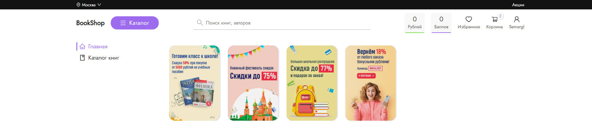
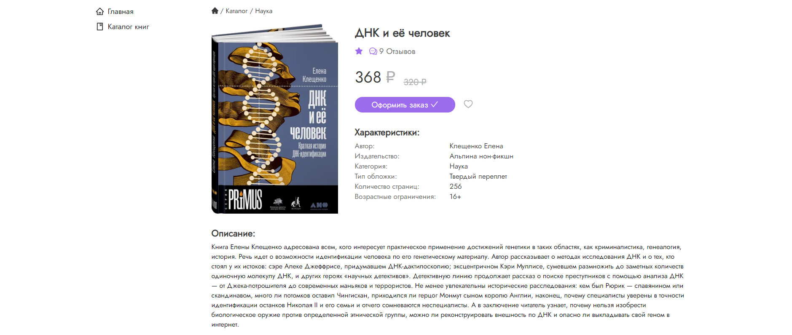
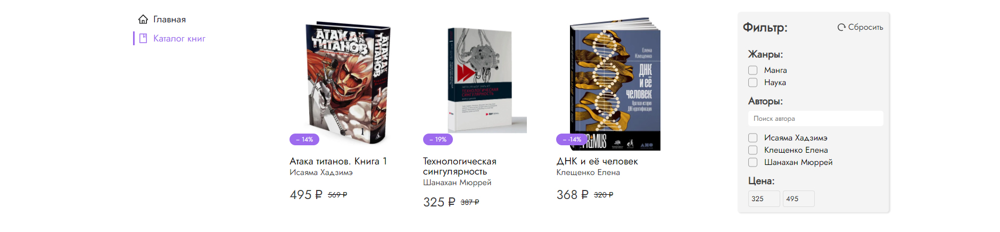
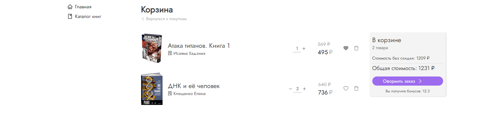

# Bookshop Frontend
The simple project for develop *React* skills. The application consists of the home page, the catalog, the detail book page, the user info, the cart and the order page.

### Technologies:
- JavaScript (ES6+), TypeScript;
- React, Redux
- Next.js
- Redux-thunk, Formik, React-cookie, Axios
- SASS, styled-components

### Pages and components:
##### 1) Header component
Component takes user data from the server and shows the following info in the header: user name, money value and scores. Input field provides an opportunity for searching books by names and authors. After entering data the search page will be shown to user with results.

##### 2) Products slider
Some products can be chosen for detailed information and added to the favorites or the cart page. There is discount a value and special offer text in the book image. The user can hover over the book card in order to see the "add to cart" button, if this product wasn't already added. Otherwise, check mark will been seen. Bookcards can be sorted by date, popularity, and price.

##### 3) Detail page
Simple detail product page for searching some information, adding the current book to the cart or the favorites page.

##### 4) Catalog page
User has an opportunity choose some category, author or set price span. This data is sent to the URL area for save filter settings after refreshing the page.

##### 5) Catalog page
The cart page keeps selected books. User can delete the current book, choose it for the favorites page and change the number of products and then cart component will show the final price.

##### 6) User page
User information. This component allows user to change their user avatar or remove it.

The component consists of fields to change user information: login, email or password.

The user can view orders

